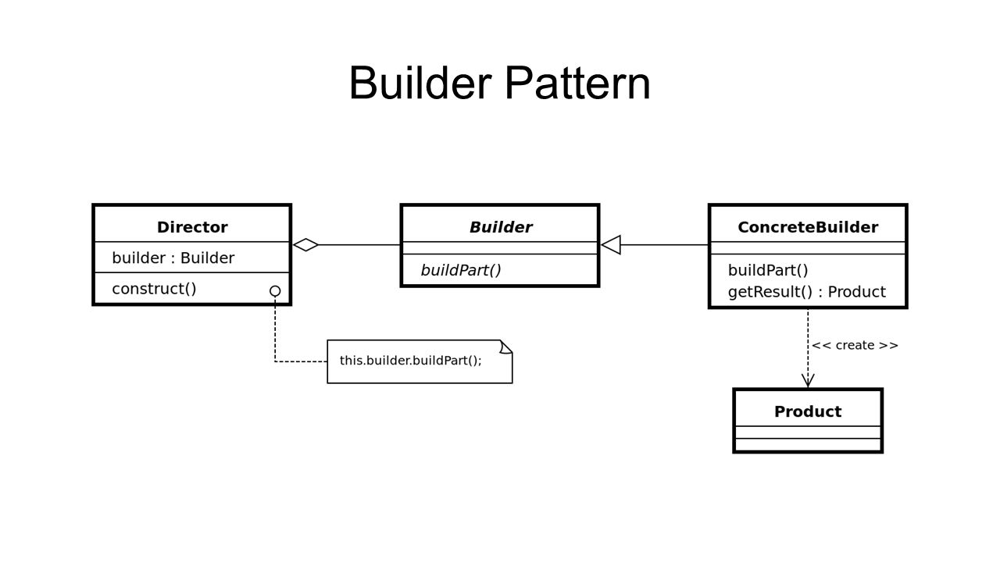

# Описание и примеры использования паттерна Builder

Паттерн решает задачу создания объектов. 
[Проблема](./src/main/java/ru/nsu/sidey383/problem/Main.java) 
[Решение](./src/main/java/ru/nsu/sidey383/slove/Main.java) 
[Применения на практике](./src/main/java/ru/nsu/sidey383/examples/Main.java) 
